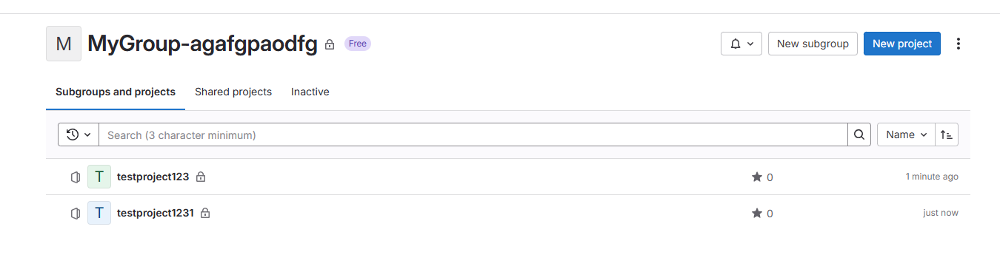

## Summary

    Bug encountered while creating a project with a duplicate name. The application allows the creation of multiple projects with the same name, leading to confusion and mismanagement of projects.

## Steps to reproduce

    1. Open GitLab and log in to your account.
    2. Navigate to the project creation page: [Project Creation URL](https://gitlab.com/projects/new).
    3. Enter a project name (e.g., "TestProjectDuplicate").
    4. Complete other required fields as needed.
    5. Submit the project creation form.
    6. Repeat steps 3-5 using the same project name "TestProjectDuplicate".

## What is the current bug behavior?

    The application creates multiple projects with the same name without displaying any warning or error message about the duplicate name.

## What is the expected correct behavior?

    The application should prevent the creation of a project with a name that already exists and should display a message like "The project name has already been taken."

## Relevant logs and/or screenshots

    
    

## Possible fixes

    The issue may lie in the backend validation of project names. Ensure that the database query checks for existing project names before allowing the creation of a new project. The relevant code may be in the project creation controller (e.g., `ProjectsController.create`).

## Whom do you report/Assign To/Tags

    /label ~bug ~reproduced ~needs-investigation  
    /cc @project-manager  
    /assign @qa-tester  

## Priority

    Major
